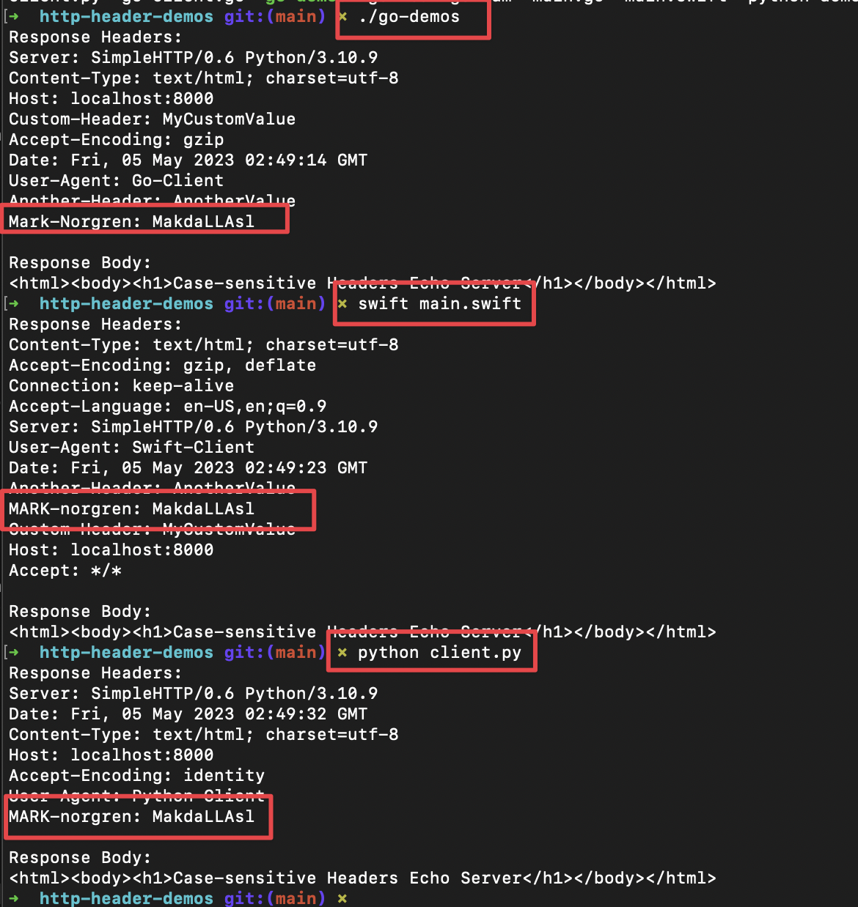

# HTTP Header Demos

HTTP Headers are case insensitive, but the convention is to use Title Case.

## RFC 7230

> Each header field consists of a case-insensitive field name followed by a colon (":"), optional leading whitespace, the field value, and optional trailing whitespace.

https://datatracker.ietf.org/doc/html/rfc7230#section-3.2

## Go Canonical Headers

> CanonicalHeaderKey returns the canonical format of the header key s. The canonicalization converts the first letter and any letter following a hyphen to upper case; the rest are converted to lowercase. For example, the canonical key for "accept-encoding" is "Accept-Encoding". If s contains a space or invalid header field bytes, it is returned without modifications.

https://pkg.go.dev/net/http#CanonicalHeaderKey

## Demos

## Links

- https://pkg.go.dev/net/http#CanonicalHeaderKey
- https://ron-liu.medium.com/what-canonical-http-header-mean-in-golang-2e97f854316d
- https://ron-liu.medium.com/what-canonical-http-header-mean-in-golang-2e97f854316d
- 